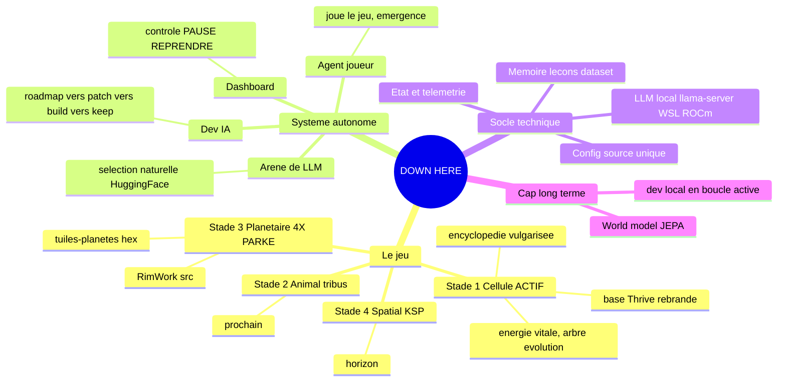
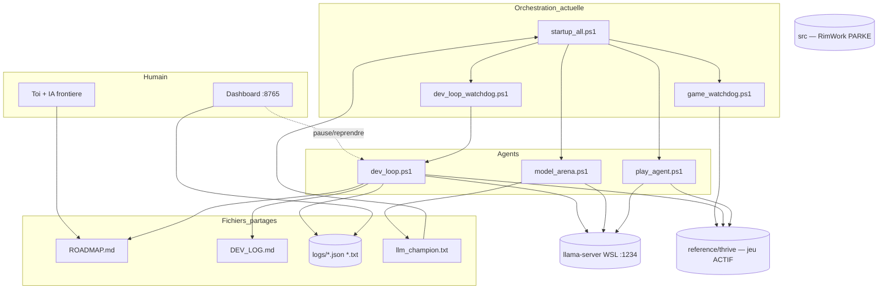
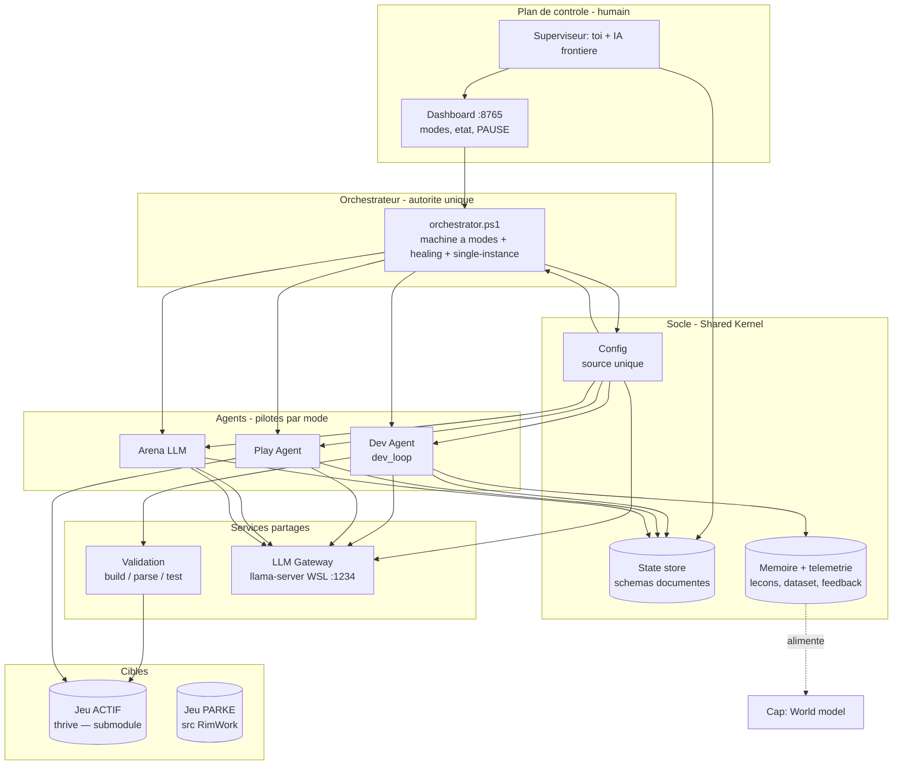
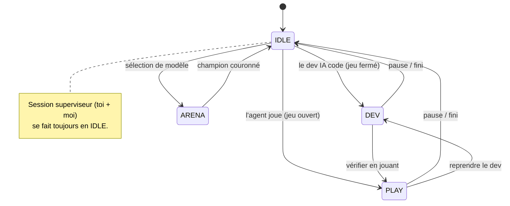
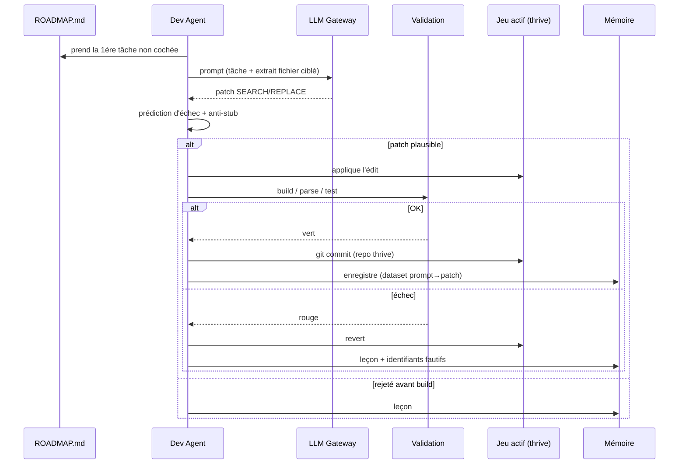

# DOWN HERE — Architecture & évolution vers un système professionnel

> Vue **schématique** du projet (carte mentale + diagrammes Mermaid) et plan
> d'évolution par phases. Les diagrammes se rendent automatiquement dans VS Code
> (extension *Markdown Preview Mermaid*) et sur GitHub. Source de vérité produit :
> [DOWN_HERE_DESIGN.md](DOWN_HERE_DESIGN.md). Ce fichier = vérité **technique**.

---

## 1. Carte mentale (le projet d'un coup d'œil)



---

## 2. État ACTUEL (as-is) — comment ça marche aujourd'hui

Tout est en **scripts PowerShell** couplés par des **fichiers** (ROADMAP.md,
JSON de logs, flags). Chemins `g:\Rimwork\…` codés en dur partout.



### Problèmes structurels
| # | Problème | Conséquence |
|---|----------|-------------|
| P1 | Chemins absolus `g:\Rimwork\…` codés en dur dans chaque script | Non clonable/relocalisable ; fragile |
| P2 | **3 lanceurs/watchdogs** séparés, pas d'autorité unique | Conflits, instances doublées, modes qui tournent ensemble |
| P3 | État **éparpillé** (health.json, current_item.json, mode implicite, blocked_items.txt, bad_identifiers.txt…) | Pas de source de vérité d'état ; difficile à observer |
| P4 | Couplage par fichiers sans **contrats** (schémas) | Un changement de format casse en silence |
| P5 | Jeu actif (`thrive`) = git séparé **gitignoré** | Clone du repo ≠ projet jouable ; pas reproductible |
| P6 | `dev_loop` échoue souvent (REVERTED/SKIPPED) — SEARCH/REPLACE brittle | Faible rendement du dev IA |
| P7 | Zéro test sur l'orchestration elle-même | Régressions invisibles |

---

## 3. Architecture CIBLE (to-be) — système professionnel en couches

Mêmes idées, **responsabilités séparées** et **contrats explicites**. On reste
sur PowerShell (pas de réécriture massive), mais structuré comme un vrai système.



**Principes pro appliqués :** source de vérité unique (Config), autorité unique
(Orchestrateur), responsabilités séparées (Agents / Services / Socle), contrats
explicites (schémas d'état), observabilité (State store + Dashboard),
reproductibilité (jeu en submodule), apprentissage capitalisé (Mémoire → cap
world-model).

---

## 4. Machine à modes (le cœur du « ça ne tourne pas en même temps »)

Aujourd'hui implicite et non garanti. Cible : **un seul mode actif à la fois**,
piloté depuis le dashboard, garanti par l'orchestrateur via `mode.json`.



---

## 5. Flux du Dev Agent (séquence d'une itération)



---

## 6. Plan d'évolution par phases

Du moins risqué (additif) au plus structurant. Chaque phase est livrable seule.

| Phase | Objectif | Touche au système vivant ? | Risque | État |
|------|----------|----------------------------|--------|------|
| **1. Config unique** | `scripts/lib/Config.ps1` (paths/ports/modèle calculés, zéro chemin absolu). | Additif puis migration | Faible | ✅ **Fait** (13 scripts migrés, testés) |
| **2. Machine à modes** | `mode.json` + `orchestrator.ps1` qui garantit l'exclusivité DEV/PLAY/ARENA/IDLE. `startup_all` ne lance plus que l'orchestrateur ; boutons de mode au dashboard. | Oui (orchestration) | Moyen | ✅ **Fait** (logique testée en dry-run) |
| **3. État consolidé** | Schémas documentés des fichiers d'état (ou SQLite). Une vue d'état unique pour le dashboard. | Modéré | Faible | ⬜ |
| **4. Jeu en submodule** | `reference/thrive` en **git submodule** → un clone donne un projet jouable et reproductible. | Repo seulement | Faible | ⬜ |
| **5. Patch robuste** | Remplacer le SEARCH/REPLACE fragile (taux d'échec élevé) par des ancres/outil de patch plus fiables. | Dev Agent | Moyen | ⬜ |
| **6. Tests d'orchestration** | Pester sur Config + machine à modes + parsing. | Additif | Faible | ⬜ |
| **7. Cap world-model** | La Mémoire (lessons + dataset + feedback) alimente un modèle prédictif de l'état du jeu (vision JEPA). | R&D | Élevé | 🌌 horizon |

---

## 7. Phases 1 & 2 — FAITES

### Phase 1 — Config unique (socle)
- `scripts/lib/Config.ps1` — **source de vérité unique**, ROOT calculé depuis
  l'emplacement du fichier (relocalisable, clonable).
- **13 scripts migrés** : zéro chemin `g:\Rimwork` en dur, plus de `localhost:1234`
  /`8765` éparpillés. Pattern adopté partout :
  ```powershell
  . "$PSScriptRoot\lib\Config.ps1"
  $cfg = Get-DownHereConfig
  ```

### Phase 2 — Machine à modes (exclusivité garantie)
- `scripts/lib/Modes.ps1` — état du mode + plan par mode + **réconciliation** des
  processus (`Invoke-ModeReconcile`, avec `-DryRun` testable).
- `scripts/orchestrator.ps1` — **autorité unique** : boucle qui lit le mode voulu
  et aligne les processus dessus (démarre/arrête). Une seule instance.
- `scripts/set-mode.ps1` — CLI : `pwsh -File set-mode.ps1 DEV|PLAY|ARENA|IDLE`.
- `startup_all.ps1` ne lance plus 4 agents en même temps : il lance **l'orchestrateur**,
  qui n'active que les agents du mode courant.
- **Dashboard** : boutons de mode (DEV/PLAY/ARENA/IDLE) + endpoint `/mode`.

Pilotage : tout passe par le dashboard (ou `set-mode.ps1`). Le mode est persisté
dans `scripts/logs/mode.json` (défaut **DEV** : le dev IA continue, jeu fermé).

### Prochaine étape proposée
**Phase 4 — Jeu en submodule** (faible risque, gros gain de reproductibilité) ou
**Phase 5 — Patch dev-IA robuste** (améliore le rendement du dev IA). À ton choix.
