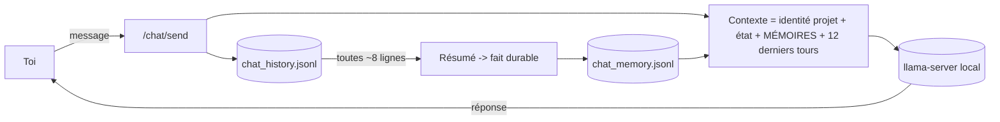

# DOWN HERE — Conversation libre + mémoire persistante

> Un onglet **http://localhost:8765/chat** où l'IA locale te parle librement
> (sans supervision tour-par-tour) et **apprend de vos échanges** via une
> mémoire persistante — **sans ré-entraîner le modèle**. Techniques réelles et
> documentées, pas de la magie.

## Ce que « parler librement, sans supervision, et apprendre » veut dire ici

- **Librement / sans supervision** : tu écris, l'IA répond toute seule (le LLM
  local génère la réponse, personne ne valide chaque tour). C'est de la
  conversation autonome.
- **Apprend de vous** : sans toucher aux poids du modèle (impossible/inutile en
  local à chaque message), l'agent **se constitue une mémoire** : il retient des
  faits durables sur toi et le projet, et les réinjecte dans son contexte aux
  conversations suivantes. C'est de l'apprentissage **par mémoire augmentée**,
  pas par gradient — la méthode standard des agents conversationnels persistants.

## Architecture (réelle, locale)

- `lib/Chat.ps1` — toute la logique : historique, mémoire, prompt, appel LLM.
- `chat_history.jsonl` — les tours bruts (user/assistant).
- `chat_memory.jsonl` — les faits durables retenus, **injectés dans le prompt
  système** (l'agent « se souvient » d'une session à l'autre).
- **Réflexion / compression** : toutes les ~8 entrées d'historique, l'agent
  résume les échanges récents en **une** mémoire durable (idée de compression
  récursive du contexte de MemGPT). C'est ainsi qu'il « apprend » continûment
  sans exploser son contexte.

## Sources (publiques)
- **MemGPT / Letta** — Packer et al., *MemGPT: Towards LLMs as Operating Systems*
  (2023) : hiérarchie de mémoire + compression récursive du contexte.
- **Generative Agents** — Park et al. (2023) : *memory stream* + réflexion ;
  comportements crédibles émergents d'agents à mémoire.
- **RAG** — Lewis et al. (2020) : augmenter un modèle par récupération de
  connaissances externes plutôt que par ré-entraînement.

## Où ça se situe vs la « RSI » d'Anthropic
La page que tu as partagée
([anthropic.com/institute/recursive-self-improvement](https://www.anthropic.com/institute/recursive-self-improvement))
définit la RSI comme « une IA capable de concevoir et développer **son propre
successeur** de façon totalement autonome », et précise : *« on n'y est pas, et
ce n'est pas inévitable »*. Leur progression : (1) l'IA **exécute** pendant que
l'humain dirige → (2) l'IA développe du **jugement** dans des domaines étroits →
(3) RSI.

**Notre système est au stade (1), avec des bouts de (2) :** l'IA exécute (dev_loop),
apprend de ses résultats (world model + policy, voir [RSI_EVIDENCE.md](RSI_EVIDENCE.md)),
montre de l'émergence en sandbox ([EMERGENCE_EVIDENCE.md](EMERGENCE_EVIDENCE.md)),
et maintenant **dialogue avec mémoire**. C'est honnête : une vraie architecture,
à échelle locale, pas la RSI complète.

## Utiliser
1. Démarre la pile : `pwsh -File scripts/startup_all.ps1` (le LLM met ~1-2 min).
2. Ouvre **http://localhost:8765** → bouton **💬 Parler à l'IA** (ou
   directement `/chat`).
3. Discute. Il se souvient (mémoire dans `scripts/logs/chat_memory.jsonl`).

> Le modèle local par défaut est un *coder* (Qwen) ; il discute correctement
> mais reste orienté technique. L'arène (mode ARENA) peut couronner un meilleur
> conversationnel ; il suffit que `llm_champion.txt` pointe dessus.
