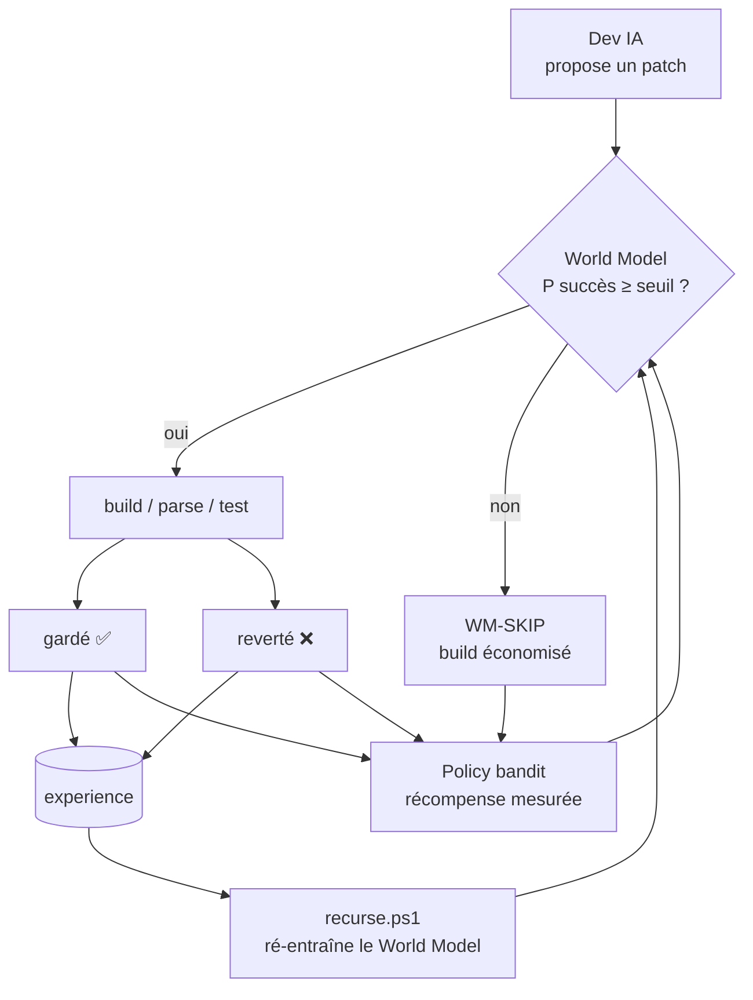

# DOWN HERE — Auto-amélioration récursive (RSI) + World Model

> Système **réel, qui tourne sur cette machine** (RX 7800XT 16 Go, llama-server
> WSL). Ce n'est PAS de l'entraînement de modèle frontière. C'est une boucle où
> le système **apprend de ses propres résultats** pour **mieux agir**, et **règle
> seul sa propre politique**. Honnête sur l'échelle : architecture inspirée des
> agents auto-améliorants (Anthropic) et des *world models* (LeCun/JEPA),
> ramenée à des moyens locaux.

---

## 1. L'idée en une phrase

Le dev IA produit des patchs. On a enregistré, pour ~462 patchs réels passés,
**lesquels ont réussi (gardés) ou échoué (build cassé)**. On entraîne là-dessus
un **world model** = un prédicteur de « ce patch va-t-il réussir ? ». Le dev IA
s'en sert pour **trier ses patchs avant de payer un build**, et une **policy
bandit règle seule** le seuil de tri d'après la récompense mesurée. Plus le
système tourne, plus il accumule d'expérience, plus le world model s'affine :
**c'est la récursion.**

## 2. La boucle récursive



**Deux boucles d'apprentissage imbriquées :**
1. **World model** — apprend la *dynamique de l'action* (patch → succès/échec)
   depuis l'expérience. Ré-entraîné périodiquement (`recurse.ps1`).
2. **Policy bandit** — apprend la *meilleure décision* (seuil de gate) par
   essai-erreur, sans qu'on le fixe à la main.

À cela s'ajoute une 3ᵉ boucle déjà en place : l'**arène de modèles**
(`model_arena.ps1`) qui sélectionne *le cerveau lui-même* (le LLM local) par
compétition — le système choisit jusqu'à l'IA qui l'exécute.

## 3. Le World Model (concret)

- **Données** : `bootstrap.py` lit l'expérience réelle —
  `training_data.jsonl` (patchs **gardés** = positifs) +
  `failed_builds.log` (patchs qui ont **cassé le build** = négatifs) +
  `experience_raw.jsonl` (vécu en direct par le dev_loop). → 462 exemples
  au démarrage (89 succès / 373 échecs).
- **Features** (`features.py`, source unique) : 13 signaux déterministes du
  patch — nb lignes search/replace, delta, taille, **nouveaux appels** `.Méthode(`,
  équilibre des accolades/parenthèses, présence d'une définition de méthode,
  placeholder, C#/JSON, points-virgules, **nouveaux identifiants**.
- **Modèle** (`train.py`, scikit-learn) : compare LogReg vs RandomForest en
  validation croisée, garde le meilleur par **AUC**. Résultat mesuré :
  **AUC ≈ 0.79** (RandomForest) — le modèle range correctement un patch
  gardé au-dessus d'un patch cassé ~79 % du temps. Bien au-dessus du hasard.
- **Inférence** (`predict.py`) : reçoit un patch en JSON, rend `P(succès)`.
  Appelé par PowerShell (`lib/WorldModel.ps1`), tolérant aux pannes (→ `NA`).
- **Transparence** : `logs/wm_model.json` expose AUC, n, importances des
  features, seuil. Top features de risque : taille du replace, nouveaux
  identifiants, nombre de lignes, delta de lignes.

## 4. La Policy bandit (auto-réglage)

`lib/Policy.ps1` — bandit ε-greedy sur des **seuils de gate candidats**
(`0` = pas de gate, puis multiples du seuil adaptatif du modèle). Récompense
par patch traité :

| Issue | Récompense | Pourquoi |
|------|-----------|----------|
| **gardé** (build OK) | 1.0 | le mieux |
| **WM-SKIP** (build économisé) | 0.5 | gain de temps, mais peut rater un bon |
| **reverté** (build payé pour rien) | 0.0 | le pire |

Le bandit converge vers le seuil qui **maximise la récompense moyenne** =
compromis entre économiser des builds et ne pas jeter les bons patchs. Persisté
dans `logs/policy.json`. **Personne ne fixe le seuil à la main : le système le
trouve.**

## 5. Comment ça tourne sur CETTE machine

- Entraînement : scikit-learn, **< 5 s** sur 462 exemples, CPU. Aucun GPU requis.
- Inférence : un appel Python par patch candidat (~0.3 s), négligeable vs un
  build C# (souvent > 30 s) — donc le gate **fait gagner du temps net**.
- Intégré au mode **DEV** : l'orchestrateur lance `recurse.ps1` ~toutes les
  30 min (ré-ingestion + ré-entraînement). Le `dev_loop` consulte le world
  model avant chaque build et met à jour expérience + policy après.
- Tout est **tolérant** : si Python ou le modèle manque, le dev_loop retombe
  sur ses heuristiques. Rien ne bloque.

## 6. Lancer / inspecter

```powershell
pwsh -File scripts/wm/bootstrap.py   # (via python) amorce l'expérience
python  scripts/wm/train.py          # entraîne le world model
pwsh -File scripts/recurse.ps1       # un cycle récursif complet (ingest+train+log)
pwsh -File scripts/recurse.ps1 -Loop # en continu
pwsh -File scripts/tests/run-tests.ps1   # tests (inclut WM + policy)
```
Observabilité : `logs/wm_model.json` (métriques), `logs/wm_history.jsonl`
(progrès dans le temps), `logs/policy.json` (ce que la policy a appris),
et le dashboard `/state.json`.

## 7. Honnêteté & limites (assumées)

- Ce n'est **pas** un modèle frontière qui réécrit ses propres poids. C'est une
  **auto-amélioration au niveau du processus** : le système améliore la
  *politique* qui produit ses changements, via un *modèle appris* de l'effet de
  ses actions. C'est exactement le type de RSI réaliste à échelle locale.
- Le world model actuel prédit le **succès build/parse** d'un patch. Étendre à
  prédire l'**effet gameplay** (le vrai « world model » du jeu) = prochaine
  étape : on collecte déjà des séries d'état (`snapshot-state.ps1` →
  `state_history.jsonl`) pour ça.
- AUC 0.79 est un bon signal, pas un oracle : le gate reste **conservateur**
  (ne saute que les patchs les plus sûrement cassés) et la policy peut revenir
  à « pas de gate » si ça marche mieux.

## 7bis. Où on se situe vs Anthropic (cadre honnête)

Anthropic ([page RSI](https://www.anthropic.com/institute/recursive-self-improvement))
définit la RSI comme « une IA capable de concevoir/développer **son propre
successeur** de façon autonome » et dit explicitement *« on n'y est pas, ce n'est
pas inévitable »*. Leur progression : (1) l'IA exécute, l'humain dirige →
(2) l'IA gagne du **jugement** sur des domaines étroits → (3) RSI.

**Nous sommes au stade (1) avec des amorces de (2)** : l'IA exécute (dev_loop),
**apprend de ses résultats** (world model + policy, prouvé), choisit un peu quoi
faire (auto-proposition de tâches), et dialogue avec mémoire.

**De plus, le système conçoit son propre successeur AU NIVEAU DE SON CERVEAU
DÉCISIONNEL** : `scripts/wm/successor.py` génère des versions améliorées du modèle
(spec : modèle + features + seuil), les évalue et **promeut seulement les
meilleures** (champion-challenger), gain mesuré **+0.170** sur 14 générations
(voir [SUCCESSOR.md](SUCCESSOR.md)). Le champion est **réellement déployé**. Ce
n'est pas une réécriture de poids ni un successeur d'architecture autonome — c'est
la forme réelle, gardée et productionnable, à notre échelle.

## 8. Inspirations

- Agents qui écrivent/améliorent du code de façon autonome et supervisée
  (direction Anthropic / Claude Code) — ici en local, supervisé par un LLM
  frontière + toi.
- *World models* et apprentissage prédictif (LeCun / JEPA) — un agent qui
  modélise les conséquences de ses actions plutôt que de générer à l'aveugle.
- Agents LLM quasi-autonomes en boucle (type « Mythos ») — boucle perception →
  décision → action → apprentissage.
- Bandits / RL pour le réglage de politique en ligne.

Voir aussi [ARCHITECTURE.md](ARCHITECTURE.md) (phases 1–7) et
[DOWN_HERE_DESIGN.md](DOWN_HERE_DESIGN.md) (vision produit).
