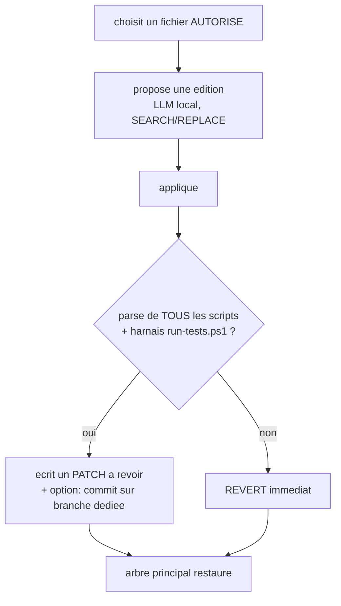

# DOWN HERE — Auto-modification du code (mode EVOLVE)

> Le système peut **réécrire son propre code** (dashboard, utilitaires) de façon
> autonome — **avec des garde-fous infranchissables**. C'est l'auto-amélioration
> au niveau du code, lignée *ADAS* (Automated Design of Agentic Systems, 2024),
> *STOP* (Self-Taught Optimizer, 2023), *Voyager* (skill library, 2023), et la
> *machine de Gödel* (Schmidhuber, conceptuel). Pas de placeholder : testé.

## Le principe

Le `dev_loop` améliore **le jeu**. `self_evolve.ps1` améliore **ses propres
scripts** : il choisit un fichier, propose une amélioration (LLM local), la
**valide**, et ne la garde que si tout reste vert — sinon **revert**. Même boucle
« propose → valide → garde/annule » que le dev, mais pointée sur sa propre
machinerie. C'est ça, la récursion au niveau du code.



## Garde-fous (un système qui se réécrit ne doit jamais lever ses propres freins)

| Garde-fou | Détail |
|---|---|
| **Allowlist** | Il ne peut éditer qu'une liste blanche de fichiers **non critiques** (`site_gen.ps1`, `llm_call.ps1`, `test_lm_api.ps1`, `downhere-dev.ps1`, `publish_site.ps1`). |
| **Protégés** | `Config.ps1`, `Modes.ps1`, `run-tests.ps1`, `self_evolve.ps1`, `orchestrator.ps1`, `startup_all.ps1`, `dev_loop.ps1`, `dashboard_server.ps1` = **jamais** éditables. Il **ne peut pas se modifier lui-même ni désactiver le harnais**. |
| **Validation** | Toute édition doit passer le **parse de tous les scripts + le harnais de tests** ; sinon **revert** automatique. |
| **Master intact** | L'arbre de travail principal est **toujours restauré**. Les éditions validées sortent en **PATCH à revoir** (`scripts/logs/self_evolve/*.patch`) ; avec `-Apply`, commit sur une **branche dédiée `self-evolve/<ts>`**. |
| **Jamais de push** | Aucune auto-publication. L'humain revoit et fusionne. Le miroir public n'est jamais touché par l'auto-modif. |
| **Exclusivité** | EVOLVE est un **mode** de la state machine : rien d'autre ne tourne pendant (pas de course sur les fichiers). |

## Preuves (testées, harnais `run-tests.ps1` = 40/40)

- **Protection** : `Config.ps1`, `run-tests.ps1`, `self_evolve.ps1` refusés ✅
- **Allowlist** : `site_gen.ps1` accepté ✅
- **Auto-maintenance** : `INDEX.md` (catalogue des scripts) auto-généré ✅
- **Édition saine** : acceptée → patch produit, **fichier restauré à l'identique** ✅
- **Édition cassée** (syntaxe invalide) : **rejetée + revert automatique** ✅
- **Mode EVOLVE** : lance bien l'auto-modif (réconciliation) ✅

## Utiliser

```powershell
pwsh -File scripts/self_evolve.ps1 -Index   # auto-maintenance : regenere scripts/INDEX.md
pwsh -File scripts/self_evolve.ps1          # un cycle autonome (LLM requis pour du code ;
                                            #   sinon -> auto-maintenance)
pwsh -File scripts/self_evolve.ps1 -Loop    # en continu (ce que fait le mode EVOLVE)
pwsh -File scripts/self_evolve.ps1 -Apply   # en plus : commit sur une branche self-evolve/<ts>
```
Depuis le **dashboard** : bouton de mode **EVOLVE**. Les patchs proposés sont
dans `scripts/logs/self_evolve/` ; revois-les (`git apply` pour adopter), ou
fusionne la branche `self-evolve/<ts>`. Tu peux ouvrir les `.patch`, `INDEX.md`
et le journal `self_evolve.log` dans **Obsidian** (ce sont des fichiers texte).

## Honnêteté & portée

- C'est de l'auto-modification **réelle et gardée**, pas de la magie : le système
  propose des améliorations **validées** de son propre code. Il **ne peut pas**
  toucher ses freins ni publier sans toi.
- Ce n'est pas « concevoir son propre successeur » au sens d'Anthropic
  ([cadre](https://www.anthropic.com/institute/recursive-self-improvement)) : on
  reste au niveau **édition de scripts gardée**, pas réécriture d'architecture
  autonome. Voir [RECURSIVE_SELF_IMPROVEMENT.md](RECURSIVE_SELF_IMPROVEMENT.md).
- La qualité des propositions dépend du LLM local (un *coder* via l'arène).

Voir [GUIDE.md](GUIDE.md), [ARCHITECTURE.md](ARCHITECTURE.md).
