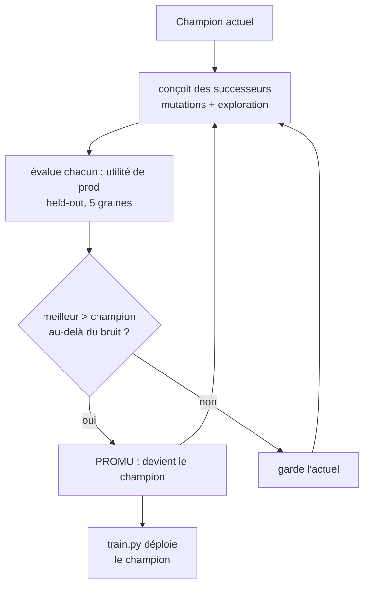

# DOWN HERE — Le système conçoit son propre successeur (mesuré)

> Forme **réelle et productionnable** de « concevoir son successeur » : le système
> génère des versions améliorées de son **propre cerveau décisionnel**, les évalue
> rigoureusement contre l'actuel, et **ne promeut un successeur que s'il est
> meilleur** (champion-challenger à promotion gardée). Génération après
> génération → amélioration **mesurée**. Méthodologie : AutoML/NAS + ADAS
> (*Automated Design of Agentic Systems*, 2024) + recherche évolutionnaire +
> gating statistique. Le champion promu est **réellement déployé**.

## Ce qu'est un « successeur » ici

Le cerveau décisionnel = la **spec** complète du modèle qui prédit si une action
(patch) réussira : quel modèle (logreg/forest/gboost) + hyperparamètres, quel
sous-ensemble de features, quel seuil de gate. « Concevoir un successeur » =
produire une nouvelle spec (mutation/recherche) et la mesurer. C'est exactement
le périmètre d'AutoML/NAS et d'ADAS (un système qui conçoit ses propres agents).



## Objectif optimisé : l'utilité de PRODUCTION (pas un proxy)

Utilité par patch : `build→gardé = 1`, `build→cassé = 0`, `gate(skip) = 0.5`.
C'est la vraie valeur (économiser un build qui aurait cassé, sans jeter les bons).
Le seuil est choisi sur le **train**, l'utilité mesurée sur le **held-out** (5
graines) — aucune fuite. On conçoit donc un successeur qui maximise directement
ce que le système cherche réellement.

## Résultat mesuré (14/06/2026, `python scripts/wm/successor.py`)

Incumbent de départ volontairement **modeste** (logreg, 4 features) pour montrer
honnêtement la montée :

| Génération | Champion | Utilité |
|---|---|---|
| 0 (départ) | logreg / 4 feat | 0.217 |
| 1 | forest / 9 feat | 0.303 (PROMU) |
| 2 | logreg / 13 feat | 0.353 (PROMU) |
| 3 | logreg / 13 feat / seuil↑ | 0.374 (PROMU) |
| 4 | logreg / 13 feat / seuil↑ | **0.386** (PROMU) |
| 5–14 | — | 0.386 (plateau : aucun successeur ne bat l'actuel au-delà du bruit) |

**Progression 0.217 → 0.386, gain +0.170 sur 14 générations.** Le champion final
**égale/dépasse** le meilleur réglage trouvé à la main, et la promotion gardée
**cesse correctement de promouvoir** quand le gain n'est plus significatif (pas
de chasse au bruit). Le champion est ensuite **déployé** (`train.py` → `model.pkl`),
donc le successeur auto-conçu devient le cerveau réel.

Génélogie complète : `scripts/logs/wm_lineage.jsonl` ; champion :
`scripts/logs/wm_champion_spec.json`.

## Intégré à la boucle récursive

`recurse.ps1` (lancé par l'orchestrateur en mode DEV, ou EVOLVE) fait à chaque
cycle : **ingère l'expérience → conçoit/évalue/promeut un successeur →
déploie le champion**. Plus le système tourne, plus il a d'expérience, plus le
successeur peut être meilleur. C'est la récursion au niveau du cerveau.

## Honnêteté & portée

- C'est de la conception de successeur **au niveau du modèle décisionnel**
  (spec : modèle + features + seuil), évaluée et promue rigoureusement — la forme
  réelle et sûre. Ce **n'est pas** un réseau qui réécrit ses poids ni un LLM qui
  réécrit le LLM ; ce serait malhonnête de le prétendre, et ce n'est pas ce que
  les labos déploient non plus.
- La promotion est **gardée** (anti-bruit) : on ne déploie que des gains réels.
  C'est volontairement conservateur — un outil de prod, pas une démo qui gonfle
  les chiffres.

## Reproduire
```powershell
python scripts/wm/successor.py --gens 14     # conçoit + promeut, écrit le champion
python scripts/wm/train.py                   # déploie le champion
python scripts/wm/evaluate.py                # mesure l'apprentissage + l'utilité
```

Voir [RSI_EVIDENCE.md](RSI_EVIDENCE.md), [RECURSIVE_SELF_IMPROVEMENT.md](RECURSIVE_SELF_IMPROVEMENT.md),
et la page Anthropic citée dans [CONVERSATION.md](CONVERSATION.md).
